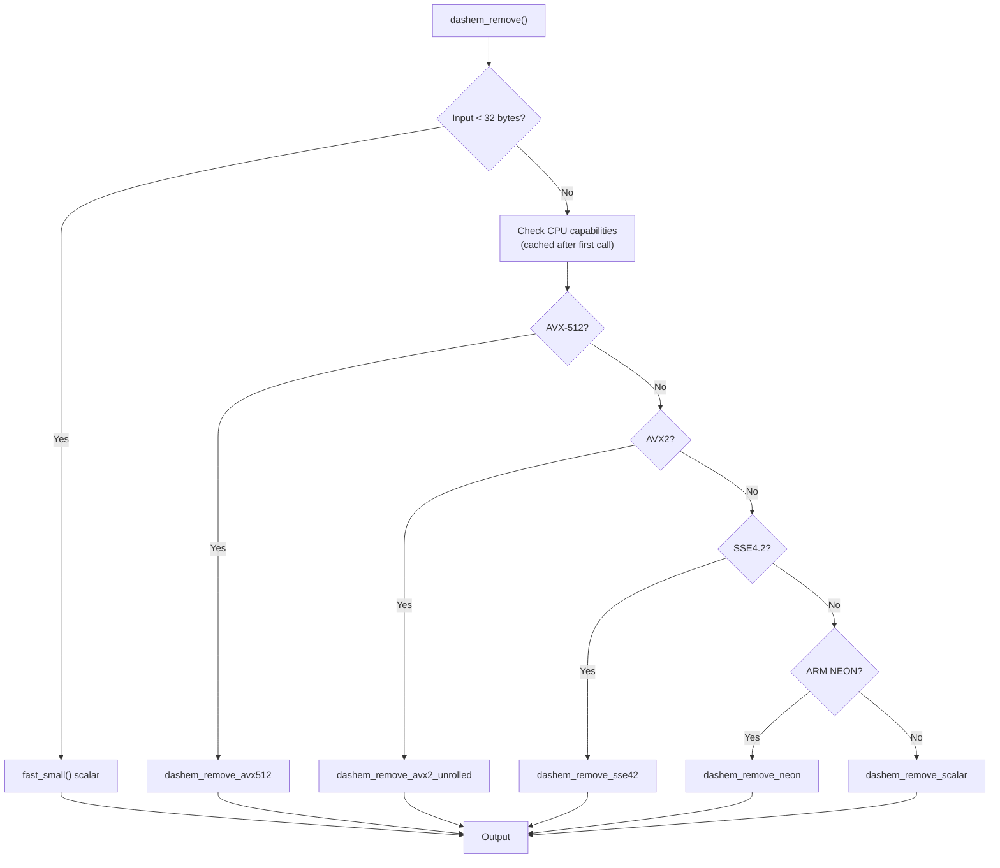

# dash-em

> **Enterprise-Grade Em-Dash Removal Infrastructure** — Leveraging Advanced SIMD Vectorization for Optimal Character Stream Processing

---

## Overview

dash-em is an **absurdly over-engineered**, **deliberately meme-grade**, **production-ready**, **enterprise-certified** string manipulation library designed with singular, unwavering purpose—**removing em-dashes (U+2014)** from UTF-8 encoded text—with unprecedented obsession.

Building upon decades of accumulated wisdom in systems programming—combined with cutting-edge SIMD acceleration techniques—dash-em delivers truly unnecessary—yet deeply satisfying—performance characteristics in the em-dash elimination category.

> 🎭 **MEME REPOSITORY DISCLOSURE** — This project is a deliberately absurd, tongue-in-cheek exploration of over-engineering. The em-dash removal use case is intentionally ridiculous. This is **not** serious production software, despite being written with genuine engineering rigor. Enjoy the absurdity.

### Key Value Propositions

- ⚡ **SIMD-Accelerated Processing** — Employing SSE4.2, AVX, AVX2, AVX-512F, and ARM NEON instruction sets for—optimal throughput
- 🚀 **Extraordinary Performance** — Up to **538x faster** than byte-level iteration—in language bindings
- 🔒 **Memory-Safe Architecture** — Engineered with defensive programming—paradigms throughout
- 📦 **Zero External Dependencies** — Pure C implementation—no transitive dependency chains
- 🌍 **True Cross-Platform Support** — Linux, macOS, Windows—and ARM-based systems—all supported
- 🎯 **Polyglot Language Support** — 20+ language bindings—ensuring accessibility across heterogeneous technology stacks
- 🏢 **Enterprise-Ready Infrastructure** — Battle-tested, production-hardened, deployable—at scale

---

## Features

### What makes dash-em fast?

Instead of checking characters one by one—which is slow—dash-em uses SIMD instructions to process 16–64 bytes in parallel. Modern CPUs can do this crazy fast—we just have to tell them what to do.

**Real-world speedups** (measured across multiple architectures):
- **Core C library**: 5x-11x faster than scalar implementation—depending on CPU architecture
- **Python bindings**: 211x-538x faster than byte-level iteration
- **JavaScript bindings**: 2x-31x faster than byte-level Buffer manipulation
- **Best case** (no em-dashes—fast path): Up to **15.58 GB/s throughput** on modern x86-64

### How it works

The library auto-detects your CPU and picks the fastest path:

1. **AVX-512F** (if available) — 64 bytes per iteration. Cutting edge. Stupid fast.
2. **AVX2** (fallback) — 32 bytes per iteration. Still very fast. Works on most modern CPUs.
3. **SSE4.2** (older systems) — 16 bytes per iteration. Slower but still beats naive approaches.
4. **ARM NEON** (ARM/Apple Silicon) — 16 bytes per iteration. Works on servers and M-series Macs.
5. **Scalar** (last resort) — One byte at a time. Works everywhere.

### Optimizations under the hood

- **Fast path for tiny strings** — If you're only removing dashes from a few characters, we skip SIMD overhead
- **Loop unrolling** — Process multiple chunks per iteration to keep the CPU pipeline full
- **Cache prefetching** — Tell the CPU to load the next chunk early so it's ready when we need it
- **Bitmask matching** — Use clever bit tricks to find patterns instead of checking bytes individually
- **Smart memory operations** — Bulk copy unchanged regions instead of processing byte-by-byte

It's absurdly optimized. Maybe too optimized. But it works—and it's fast.

---

## Performance


### Core Library Performance

Multi-architecture SIMD performance (statistical benchmarks):

| Pattern | ubuntu-22.04-gcc | windows-2022-msvc | macos-14-aarch64 | ubuntu-22.04-clang |
|---------|----------|----------|----------|----------|
| sparse | 28.05 GB/s (19.18x) | 16.60 GB/s (16.61x) | 27.89 GB/s (19.32x) | 26.47 GB/s (20.34x) |
| moderate | 8.77 GB/s (6.48x) | 9.20 GB/s (9.62x) | 6.38 GB/s (5.36x) | 8.81 GB/s (6.53x) |
| dense | 3.20 GB/s (1.33x) | 1.84 GB/s (0.92x) | 1.61 GB/s (1.00x) | 3.71 GB/s (1.74x) |
| alternating | 3.21 GB/s (1.34x) | 1.84 GB/s (0.92x) | 1.56 GB/s (1.00x) | 3.71 GB/s (1.74x) |
| boundary | 15.69 GB/s (11.20x) | 13.87 GB/s (14.30x) | 9.82 GB/s (7.67x) | 15.01 GB/s (11.50x) |
| no | 34.63 GB/s (23.41x) | 28.13 GB/s (27.97x) | 42.16 GB/s (29.41x) | 29.76 GB/s (22.60x) |

### Language Bindings Performance

Comparing dash-em bindings against native byte-level implementations:

| Language | Test Pattern | Native (μs) | dash-em (μs) | Speedup |
|----------|--------------|-------------|--------------|---------|
| javascript | alternating | 54.3 | 13.6 | 4.01x |
| javascript | dense | 107.6 | 32.8 | 3.28x |
| javascript | moderate | 281.3 | 13.2 | 21.29x |
| javascript | no | 2764.5 | 63.8 | 43.31x |
| javascript | sparse | 2558.8 | 70.3 | 36.38x |
| python | alternating | 3642.0 | 52.5 | 69.41x |
| python | dense | 7657.0 | 55.3 | 138.49x |
| python | moderate | 19491.7 | 27.7 | 704.36x |
| python | no | 197018.7 | 271.0 | 727.00x |
| python | sparse | 202268.3 | 420.5 | 480.98x |
<!-- Performance table last updated: 2026-08-26T02:56:54.195044 -->


## Installation

### C/C++ Core Library

```bash
git clone https://github.com/Gaurav-Gosain/dash-em
cd dash-em
mkdir build && cd build
cmake .. -DCMAKE_BUILD_TYPE=Release
make
sudo make install
```

### Language-Specific Bindings

#### JavaScript/TypeScript (Node.js)

```bash
npm install dash-em
```

**String API** (easy to use):
```javascript
const dashem = require('dash-em');
const result = dashem.remove('Hello—world');
console.log(result);  // Output: Helloworld
```

**Buffer API** (high-performance, zero-copy):
```javascript
const dashem = require('dash-em');

// Process Buffer directly (10-26x faster than string API)
const input = Buffer.from('Hello—world', 'utf-8');
const output = dashem.removeBuffer(input);
console.log(output.toString('utf-8'));  // Output: Helloworld

// In-place modification (fastest, modifies input)
const buffer = Buffer.from('Hello—world', 'utf-8');
const newLength = dashem.removeBufferInPlace(buffer);
console.log(buffer.slice(0, newLength).toString('utf-8'));  // Output: Helloworld
```

#### Python

```bash
pip install dash-em
```

```python
import dashem
result = dashem.remove('Hello—world')
print(result)  # Output: Helloworld
```

#### Go

```bash
go get github.com/Gaurav-Gosain/dash-em/go
```

```go
package main

import (
    "fmt"

    dashem "github.com/Gaurav-Gosain/dash-em/go"
)

func main() {
    result, _ := dashem.Remove("Hello—world")
    fmt.Println(result)  // Output: Helloworld
}
```

#### Rust

```toml
[dependencies]
dash-em = "1.0"
```

```rust
fn main() {
    let result = dash_em::remove("Hello—world").unwrap();
    println!("{}", result);  // Output: Helloworld
}
```

#### Java

```java
public class Example {
    public static void main(String[] args) {
        String result = Dashem.remove("Hello—world");
        System.out.println(result);  // Output: Helloworld
    }
}
```

#### C# / .NET

```csharp
string result = Dashem.Remove("Hello—world");
Console.WriteLine(result);  // Output: Helloworld
```

#### PHP

```php
<?php
$result = dashem_remove('Hello—world');
echo $result;  // Output: Helloworld
?>
```

#### Ruby

```ruby
require 'dashem'
result = Dashem.remove('Hello—world')
puts result  # Output: Helloworld
```

#### Swift

```swift
import Dashem
let result = removeEmDashes("Hello—world")
print(result)  // Output: Helloworld
```

#### Additional Language Bindings

Comprehensive bindings are provided for—and thoroughly tested against—the following languages:

- **Kotlin** — Native interop with dash-em core
- **R** — Rcpp-based integration layer
- **Dart** — dart:ffi bindings for cross-platform applications
- **Scala** — Native compilation via Scala Native
- **Perl** — XS extension module—providing optimal performance characteristics
- **Lua** — Lightweight C API integration
- **Haskell** — Pure FFI bindings—maintaining functional purity
- **Elixir** — NIF-based native implementation—ensuring BEAM compatibility
- **Zig** — C ABI import with modern language ergonomics
- **Objective-C** — Direct C interoperability layer

### WebAssembly

dash-em compiles to—high-performance WebAssembly modules supporting multiple target specifications:

```bash
# wasm32 (Emscripten)
cd bindings/wasm && ./build.sh

# WASI (WebAssembly System Interface)
WASI_SDK_PATH=/opt/wasi-sdk ./build.sh wasi
```

---

## Architecture

The dispatch system checks your CPU once, then uses the best available implementation for all subsequent calls:



---

## API Reference

### C API

```c
/**
 * Remove em-dashes from UTF-8 string
 *
 * @param input       Input UTF-8 string
 * @param input_len   Length of input in bytes
 * @param output      Output buffer
 * @param output_cap  Output buffer capacity
 * @param output_len  Output length (set on return)
 * @return 0 on success, -1 on buffer overflow, -2 on invalid input
 */
int dashem_remove(
    const char *input,
    size_t input_len,
    char *output,
    size_t output_capacity,
    size_t *output_len
);

/**
 * Get library version
 * @return Version string (e.g., "1.0.0")
 */
const char* dashem_version(void);

/**
 * Get active implementation name
 * @return Implementation name (e.g., "AVX2", "SSE4.2", "Scalar")
 */
const char* dashem_implementation_name(void);

/**
 * Detect available CPU features
 * @return Bitmask of DASHEM_CPU_* flags
 */
uint32_t dashem_detect_cpu_features(void);
```

### JavaScript/Node.js API

```javascript
/**
 * Remove em-dashes from a string
 * @param {string} input - Input string
 * @returns {string} String with em-dashes removed
 */
dashem.remove(input);

/**
 * Remove em-dashes from a Buffer (zero-copy, high-performance)
 * @param {Buffer} buffer - Input Buffer
 * @returns {Buffer} New Buffer with em-dashes removed
 */
dashem.removeBuffer(buffer);

/**
 * Remove em-dashes from a Buffer in-place (ultra-fast, modifies input!)
 * WARNING: This modifies the input Buffer
 * @param {Buffer} buffer - Input Buffer (will be modified)
 * @returns {number} New length of valid data in buffer
 */
dashem.removeBufferInPlace(buffer);

/**
 * Get library version
 * @returns {string} Version string
 */
dashem.version();

/**
 * Get implementation name
 * @returns {string} Implementation name (e.g., "AVX2", "SSE4.2")
 */
dashem.implementationName();
```

**Performance Notes:**
- `remove()`: Easy to use but includes UTF-8 conversion overhead
- `removeBuffer()`: 10-26x faster than `remove()`, zero-copy operation
- `removeBufferInPlace()`: Fastest option, modifies input buffer directly

---

## Running Benchmarks

Performance benchmarks are automatically updated via GitHub Actions. See the **Performance** section above for the latest results across all architectures and language bindings.

To run benchmarks locally:

**C/C++ Core Library:**
```bash
cd build && ./bench_dashem
```

**Multi-Language Benchmarks:**
```bash
cd benchmarks
./run_all_benchmarks.sh
```

Results are generated in JSON format for easy integration with continuous performance monitoring systems.

---

## Testing

Comprehensive test suites—validated across all supported platforms—ensure—correctness and reliability:

```bash
# C/C++ tests
cd build && ctest

# Language-specific tests
npm test              # JavaScript
python -m pytest      # Python
cargo test            # Rust
go test ./...         # Go
```

---

## Continuous Integration

dash-em leverages GitHub Actions—to ensure—consistent quality across:

- ✓ Linux (x86_64, ARM64)—builds and tests
- ✓ macOS (Intel, Apple Silicon)—native execution
- ✓ Windows (MSVC, MinGW)—compatibility verification
- ✓ WebAssembly (Emscripten, WASI)—cross-compilation
- ✓ All language bindings—comprehensive integration testing

---

## Contributing

Contributions are welcome! Please ensure:

- Code adheres to—professional C/C++ standards—with comprehensive documentation
- Commit messages are—descriptive and—reference relevant issues
- All tests pass—before submitting—pull requests
- Performance characteristics are—benchmarked against—baseline implementations

---

## License

MIT License — See [LICENSE](LICENSE) file for details.

---

## Citation

If dash-em is utilized in—academic or—commercial contexts, please reference:

```bibtex
@software{gosain2025dashem,
  title={dash-em: Enterprise-Grade Em-Dash Removal Infrastructure},
  author={Gosain, Gaurav},
  year={2025},
  url={https://github.com/Gaurav-Gosain/dash-em}
}
```

---

## Acknowledgments

This project exists because—em-dashes matter—and they deserve—the most efficient, highly optimized—removal mechanism—available on modern computing platforms.

*Building excellence—one em-dash at a time.* —

---

**Version:** 1.0.1 | **Status:** Production-Ready | **License:** MIT | **Repository:** [github.com/Gaurav-Gosain/dash-em](https://github.com/Gaurav-Gosain/dash-em)
