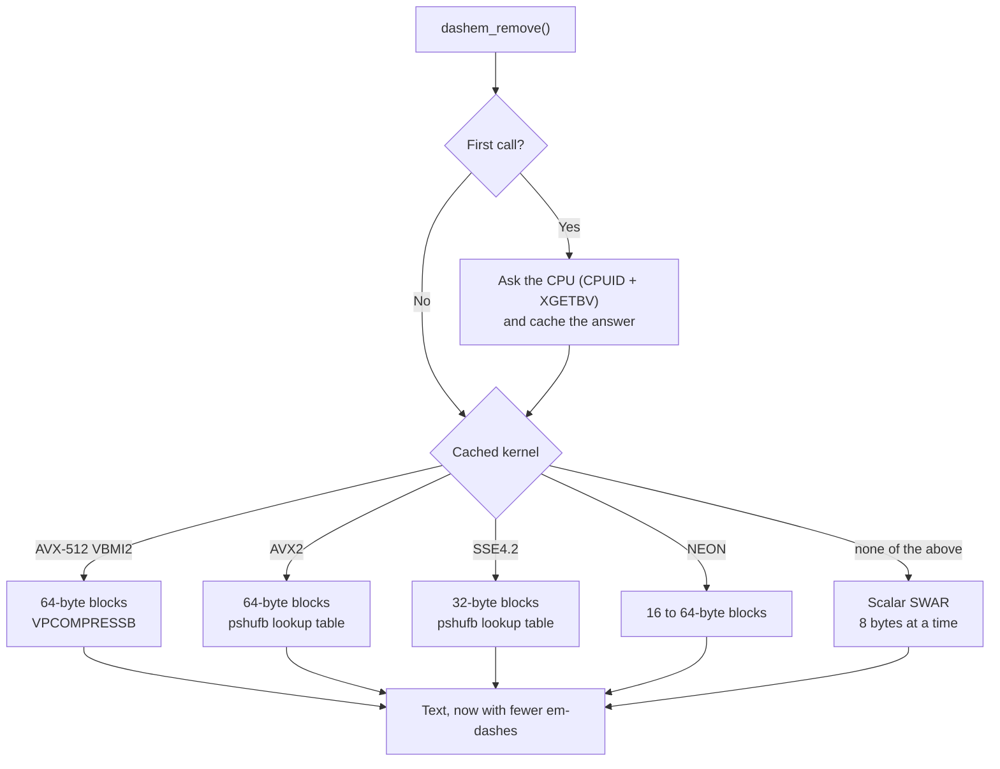

# dash-em

> **Enterprise-Grade Em-Dash Removal Infrastructure** — SIMD-accelerated, runtime-dispatched, fuzz-tested, and still not sure why it exists

---

## Overview

dash-em removes one character from text. That character is the em-dash (U+2014, `E2 80 94` in UTF-8). It removes it very, very fast.

It does nothing else. It has no plans to do anything else. It has a roadmap anyway.

> **MEME REPOSITORY DISCLOSURE** — This project is a joke about over-engineering. The engineering is not a joke. The kernels are real, the fuzz tests are real, and the bugs we found in them were extremely real.

### Key Value Propositions

- **SIMD-Accelerated Processing** — AVX-512 VBMI2, AVX2, SSE4.2, ARM NEON, and a scalar fallback for the brave
- **Runtime Dispatch** — Build once with generic flags. The library asks the CPU what it can do and picks a kernel when it runs
- **Zero External Dependencies** — One C file. One header. One purpose. Zero chill
- **Polyglot Support** — Bindings for Python, Node.js, Go, Rust, Java, C#, PHP, Ruby and Swift. Ten more directories exist and contain nothing, which we consider a minimalist design statement
- **Enterprise-Ready** — We have a citation block, three version numbers and a bot. That is the definition of enterprise

---

## The Meta Section

Some facts about this repository. All of them are true. We checked.

- **This README contains 26 em-dashes.** dash-em removes all of them in about 330 nanoseconds on an Intel i7-10700. We keep them in on purpose. A README without em-dashes would be a product demo, and a product demo is marketing.
- **The bot has more commits than the humans.** The nightly benchmark job commits fresh numbers to this README. It has made more than 200 commits. The humans have made about 100. The bot does not take holidays.
- **The README had a memory leak.** Each nightly run added one blank line under the `## Performance` heading. After 216 runs, the section began with 216 empty lines. That is one blank line per bot commit. The leak is fixed. The bot has not been told.
- **macOS CI was red for seven months.** A NEON "optimization" removed only the first byte of some em-dashes. It left the other two (`80 94`) in the text, where they sat like the ghost of punctuation. Nobody noticed, because the CI badge was not in the README. It is fixed.
- **The AVX-512 VBMI2 kernel was labeled "REVOLUTIONARY" in a comment.** It returned the wrong output in 49% of fuzz cases on the exact CPUs it was written for. It also read past the end of your buffer. It has been replaced by a kernel with a less exciting comment and a 0% failure rate.
- **The latest speedups were written by an AI model.** AI models are the leading global supplier of em-dashes. We see no conflict of interest.
- **dash-em has three version numbers.** The CMake project says 1.0.1. The CMake package config says 1.0.0. The header and the bindings say 1.1.2. Pick the one that matches your risk tolerance.

---

## How It Works

### Runtime dispatch

The library checks the CPU once, on the first call, and caches the result. Each x86 kernel is compiled for its own instruction set, so a Python wheel or a Rust crate built for generic x86-64 still gets AVX2 or AVX-512 on a machine that has them. Before this change, those builds ran the scalar loop. They were very portable and very slow.

| Kernel | Bytes per step | Notes |
|--------|----------------|-------|
| AVX-512 VBMI2 | 64 | Packs the kept bytes with `VPCOMPRESSB`. Ice Lake and newer Intel, Zen 4 and newer AMD |
| AVX2 | 64 | Packs the kept bytes with a `pshufb` lookup table. Most x86 CPUs since 2013 |
| SSE4.2 | 32 | Same algorithm, half the width, for CPUs that remember Windows 7 |
| NEON | 16 to 64 | ARM servers and Apple Silicon |
| Scalar | 8 | SWAR bit tricks. Works on a toaster, if the toaster has a C compiler |

### The algorithm

Every x86 kernel does the same five steps for each block:

1. Compare the block, the block shifted by one byte, and the block shifted by two bytes against `E2`, `80` and `94`.
2. AND the three results. Each set bit marks the start of an em-dash.
3. Expand each start bit to cover all three bytes. Carry up to two bytes into the next block, for em-dashes that start at the end of a block.
4. Pack the kept bytes together with one shuffle (or one `VPCOMPRESSB`).
5. Store them. Move on. Never look back. Never look for an em-dash that is not there.

Blocks without an `E2` byte take a fast path that is one compare and one store. The work per block does not depend on how many em-dashes it contains, so dense text no longer falls off a cliff.

### Speedups from the rewrite

Measured on an Intel i7-10700 (AVX2), best of several runs:

| Case | Before | After |
|------|--------|-------|
| Dense (25% em-dashes) | 4.5 GB/s | 7.0 GB/s |
| Alternating | 4.4 GB/s | 7.1 GB/s |
| Sparse, in place | 1.4 GB/s | 16.5 GB/s |
| Dense, in place | 2.5 GB/s | 7.1 GB/s |
| 64-byte string | 20.6 ns | 6.6 ns |
| Python wheel, any pattern | scalar | AVX2 or better |

Text with no em-dashes was already limited by memory bandwidth. It stays at about 26 GB/s. You cannot remove em-dashes faster than you can read the text. We tried.

### How we know it works

Each kernel runs against a reference implementation for every input length up to 4,160 bytes. The tests cover out-of-place and in-place calls, random alignments, and exact-size heap buffers under AddressSanitizer and UndefinedBehaviorSanitizer. The AVX-512 kernel runs under the Intel Software Development Emulator, because the development machine does not have AVX-512 and refused to grow it. The NEON kernel runs on x86 through a plain-C model of the eight NEON intrinsics it uses.

To check the checker, we broke the carry logic on purpose. The fuzz test reported 6,917 failures. Then we fixed it again.

---

## Performance

### Core Library Performance

Multi-architecture SIMD performance (statistical benchmarks):

| Pattern | ubuntu-22.04-gcc | windows-2022-msvc | macos-14-aarch64 | ubuntu-22.04-clang |
|---------|----------|----------|----------|----------|
| sparse | 25.34 GB/s (17.35x) | 29.34 GB/s (29.42x) | 21.75 GB/s (20.21x) | 39.67 GB/s (23.65x) |
| moderate | 10.94 GB/s (8.11x) | 11.69 GB/s (12.30x) | 5.89 GB/s (5.00x) | 26.37 GB/s (15.17x) |
| dense | 6.32 GB/s (2.62x) | 5.82 GB/s (2.89x) | 1.56 GB/s (1.09x) | 23.35 GB/s (8.51x) |
| alternating | 6.32 GB/s (2.63x) | 6.01 GB/s (3.48x) | 1.48 GB/s (1.09x) | 23.32 GB/s (8.48x) |
| boundary | 18.69 GB/s (13.33x) | 18.50 GB/s (19.06x) | 8.30 GB/s (7.67x) | 35.21 GB/s (21.00x) |
| no | 28.02 GB/s (18.95x) | 26.00 GB/s (25.84x) | 40.34 GB/s (29.35x) | 39.54 GB/s (23.31x) |

### Language Bindings Performance

Comparing dash-em bindings against native byte-level implementations:

| Language | Test Pattern | Native (μs) | dash-em (μs) | Speedup |
|----------|--------------|-------------|--------------|---------|
| javascript | alternating | 72.9 | 9.49 | 7.68x |
| javascript | dense | 113.9 | 16.1 | 7.05x |
| javascript | moderate | 320.4 | 11.4 | 28.10x |
| javascript | no | 2958.1 | 76.5 | 38.65x |
| javascript | sparse | 2935.0 | 79.7 | 36.85x |
| python | alternating | 3804.2 | 8.30 | 458.11x |
| python | dense | 7853.0 | 12.1 | 646.99x |
| python | moderate | 19544.3 | 19.0 | 1026.16x |
| python | no | 199207.2 | 194.1 | 1026.57x |
| python | sparse | 199106.8 | 349.5 | 569.76x |
<!-- Performance table last updated: 2026-10-04T23:28:04.470514 -->


## Installation

### C/C++ Core Library

```bash
git clone https://github.com/Gaurav-Gosain/dash-em
cd dash-em
mkdir build && cd build
cmake .. -DCMAKE_BUILD_TYPE=Release
make
sudo make install
```

### Language-Specific Bindings

#### JavaScript/TypeScript (Node.js)

```bash
npm install dash-em
```

**String API** (easy to use):
```javascript
const dashem = require('dash-em');
const result = dashem.remove('Hello—world');
console.log(result);  // Output: Helloworld
```

**Buffer API** (high-performance, zero-copy):
```javascript
const dashem = require('dash-em');

// Process Buffer directly (10-26x faster than string API)
const input = Buffer.from('Hello—world', 'utf-8');
const output = dashem.removeBuffer(input);
console.log(output.toString('utf-8'));  // Output: Helloworld

// In-place modification (fastest, modifies input)
const buffer = Buffer.from('Hello—world', 'utf-8');
const newLength = dashem.removeBufferInPlace(buffer);
console.log(buffer.slice(0, newLength).toString('utf-8'));  // Output: Helloworld
```

#### Python

```bash
pip install dash-em
```

```python
import dashem
result = dashem.remove('Hello—world')
print(result)  # Output: Helloworld
```

#### Go

```bash
go get github.com/Gaurav-Gosain/dash-em/go
```

```go
package main

import (
    "fmt"

    dashem "github.com/Gaurav-Gosain/dash-em/go"
)

func main() {
    result, _ := dashem.Remove("Hello—world")
    fmt.Println(result)  // Output: Helloworld
}
```

#### Rust

```toml
[dependencies]
dash-em = "1.0"
```

```rust
fn main() {
    let result = dash_em::remove("Hello—world").unwrap();
    println!("{}", result);  // Output: Helloworld
}
```

#### Java

```java
public class Example {
    public static void main(String[] args) {
        String result = Dashem.remove("Hello—world");
        System.out.println(result);  // Output: Helloworld
    }
}
```

#### C# / .NET

```csharp
string result = Dashem.Remove("Hello—world");
Console.WriteLine(result);  // Output: Helloworld
```

#### PHP

```php
<?php
$result = dashem_remove('Hello—world');
echo $result;  // Output: Helloworld
?>
```

#### Ruby

```ruby
require 'dashem'
result = Dashem.remove('Hello—world')
puts result  # Output: Helloworld
```

#### Swift

```swift
import Dashem
let result = removeEmDashes("Hello—world")
print(result)  // Output: Helloworld
```

#### Additional Language Bindings

Directories exist for Kotlin, R, Dart, Scala, Perl, Lua, Haskell, Elixir, Zig and Objective-C. They are empty. They have never failed a test. They have a 100% pass rate and a 0% line count, which is the best ratio in the repository.

Pull requests that put code in them are welcome. Pull requests that remove them will be considered an attack on our language support numbers.

### WebAssembly

dash-em compiles to WebAssembly, where it uses the scalar kernel and contemplates its life choices:

```bash
# wasm32 (Emscripten)
cd bindings/wasm && ./build.sh

# WASI (WebAssembly System Interface)
WASI_SDK_PATH=/opt/wasi-sdk ./build.sh wasi
```

---

## Architecture


```mermaid
graph TD
    A["dashem_remove()"] --> B{"First call?"}
    B -->|Yes| C["Ask the CPU (CPUID + XGETBV)<br/>and cache the answer"]
    B -->|No| D{"Cached kernel"}
    C --> D
    D -->|AVX-512 VBMI2| E["64-byte blocks<br/>VPCOMPRESSB"]
    D -->|AVX2| F["64-byte blocks<br/>pshufb lookup table"]
    D -->|SSE4.2| G["32-byte blocks<br/>pshufb lookup table"]
    D -->|NEON| H["16 to 64-byte blocks"]
    D -->|none of the above| I["Scalar SWAR<br/>8 bytes at a time"]
    E --> J["Text, now with fewer em-dashes"]
    F --> J
    G --> J
    H --> J
    I --> J
```

Very short inputs use the scalar code (or masked loads on AVX-512). The last partial block of a long input is processed as one more full block that ends at the end of the input, so the kernels never read past your buffer. We used to read past your buffer. We apologize to your buffer.

---

## API Reference

### C API

```c
/**
 * Remove em-dashes from UTF-8 string
 *
 * @param input       Input UTF-8 string
 * @param input_len   Length of input in bytes
 * @param output      Output buffer (may equal input for in-place use)
 * @param output_cap  Output buffer capacity (at least input_len)
 * @param output_len  Output length (set on return)
 * @return 0 on success, -1 on buffer overflow, -2 on invalid input
 *
 * Bytes of the output buffer after *output_len, up to input_len,
 * may be overwritten with scratch data.
 */
int dashem_remove(
    const char *input,
    size_t input_len,
    char *output,
    size_t output_capacity,
    size_t *output_len
);

/**
 * Get library version
 * @return Version string (one of our several version numbers)
 */
const char* dashem_version(void);

/**
 * Get active implementation name
 * @return "AVX-512 VBMI2 (VPCOMPRESSB)", "AVX2", "SSE4.2", "NEON" or "Scalar"
 */
const char* dashem_implementation_name(void);

/**
 * Detect available CPU features
 * @return Bitmask of DASHEM_CPU_* flags
 */
uint32_t dashem_detect_cpu_features(void);
```

### JavaScript/Node.js API

```javascript
/**
 * Remove em-dashes from a string
 * @param {string} input - Input string
 * @returns {string} String with em-dashes removed
 */
dashem.remove(input);

/**
 * Remove em-dashes from a Buffer (zero-copy, high-performance)
 * @param {Buffer} buffer - Input Buffer
 * @returns {Buffer} New Buffer with em-dashes removed
 */
dashem.removeBuffer(buffer);

/**
 * Remove em-dashes from a Buffer in-place (ultra-fast, modifies input!)
 * WARNING: This modifies the input Buffer
 * @param {Buffer} buffer - Input Buffer (will be modified)
 * @returns {number} New length of valid data in buffer
 */
dashem.removeBufferInPlace(buffer);

/**
 * Get library version
 * @returns {string} Version string
 */
dashem.version();

/**
 * Get implementation name
 * @returns {string} Implementation name (e.g., "AVX2", "SSE4.2")
 */
dashem.implementationName();
```

**Performance Notes:**
- `remove()`: Easy to use but includes UTF-8 conversion overhead
- `removeBuffer()`: 10-26x faster than `remove()`, zero-copy operation
- `removeBufferInPlace()`: Fastest option, modifies input buffer directly

---

## Running Benchmarks

A bot runs the benchmarks every night and commits the results to the Performance section above. Please do not edit that section by hand. The bot will overwrite your changes, and it has more commit access than you think.

To run benchmarks locally:

```bash
cd build && ./bench_statistical
```

---

## Testing

```bash
# C/C++ tests
cd build && ctest

# Language-specific tests
npm test              # JavaScript
python -m pytest      # Python
cargo test            # Rust
go test ./...         # Go
```

---

## Continuous Integration

GitHub Actions builds and tests the library and the bindings on Linux, macOS (Apple Silicon) and Windows (MSVC). Benchmarks run on x86-64 with GCC, Clang and MSVC, and on ARM64.

The CI is green when the em-dashes are gone. When the CI is red, an em-dash has escaped. Treat it as a security incident.

---

## Contributing

Contributions are welcome. Please make sure that:

- All tests pass
- Performance claims come with a benchmark
- Comments that say "REVOLUTIONARY" come with a fuzz test

---

## License

MIT License — See [LICENSE](LICENSE) file for details.

---

## Citation

If dash-em is used in academic or commercial work, please cite it. Then please tell us why.

```bibtex
@software{gosain2025dashem,
  title={dash-em: Enterprise-Grade Em-Dash Removal Infrastructure},
  author={Gosain, Gaurav},
  year={2025},
  url={https://github.com/Gaurav-Gosain/dash-em}
}
```

---

## Acknowledgments

This project exists because—em-dashes matter—and they deserve—the most efficient, highly optimized—removal mechanism—available on modern computing platforms.

*Building excellence—one em-dash at a time.* —

---

**Version:** 1.0.1 (or 1.1.2, or 1.0.0) | **Status:** Production-Ready | **License:** MIT | **Repository:** [github.com/Gaurav-Gosain/dash-em](https://github.com/Gaurav-Gosain/dash-em)
